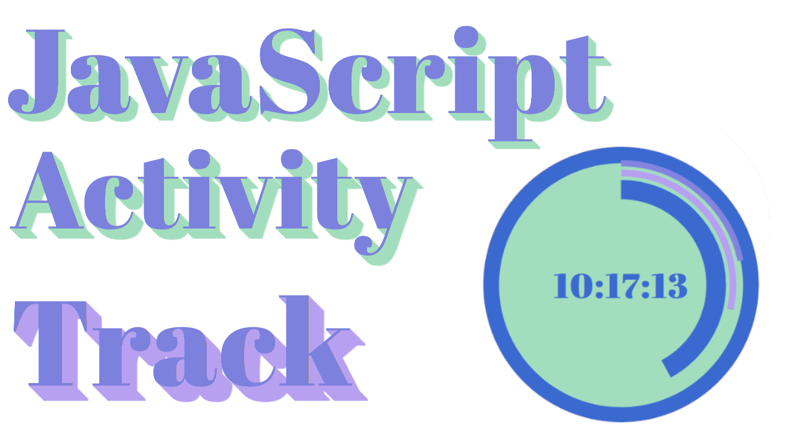

# 🏋️‍♂️⌛🥇 JS - Track Activity App

<!-- ## Background -->

> Super Simple JavaScript app to keep track of daily activities!

### 📚 STACK
- Html
- Css
- Javascript

## ⏱️ Installation

Open index.html in your browser.
Press the Start button.

## 🐛 Bugs

...sure

### Video Guide Link
    
[Video Guide]()

## License

Usage is provided under the MIT License. See [LICENSE](https://github.com/Yilber/readme-boilerplate/blob/master/LICENSE) for the full details.

#####@🥋